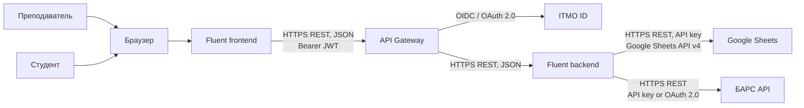
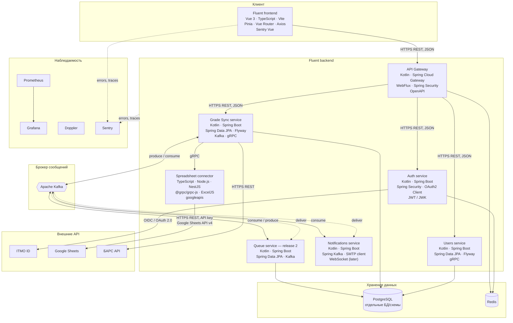

# Fluent: архитектура приложения (G2.1)

## 1. Архитектурные принципы

- frontend обращается только к API Gateway;
- синхронная связь внутренних сервисов — **gRPC + Protobuf**;
- длительные операции и оповещения, асинхронная связь — **Kafka**;
- каждый сервис владеет только своими данными: отдельная БД либо схема в одной общей, без прямых SQL-запросов в чужие таблицы;
- все компоненты, включая PostgreSQL и Redis, запускаются Docker-контейнерами;
- публикация Kafka-события выполняется через transactional outbox, потребители
  идемпотентны по `eventId`;
- HTTP используется на внешнем контуре: browser, ITMO ID, Google APIs и БАРС.

## 2. Контекст системы

## 3. Контейнерная схема

## 4. Модули и ответственность

| Модуль                | Зона ответственности                                                                                | Данные                        | Интерфейсы взаимодействия                     | Асинхронные события                                  |
|-----------------------|-----------------------------------------------------------------------------------------------------|-------------------------------|-----------------------------------------------|------------------------------------------------------|
| Fluent frontend       | Личные кабинеты преподавателя и администратора; загрузка и маппинг; preview; подтверждение экспорта | Только browser state          | REST через Gateway                            | —                                                    |
| API Gateway           | Единая внешняя точка, CORS, проверка JWT, rate limit, маршрутизация и OpenAPI                       | Не хранит доменные данные     | HTTPS REST наружу и к сервисам                | Метрики и audit log без ПД пользователей             |
| Auth service          | Вход через ITMO ID, выпуск/обновление JWT, роли и сессии                                            | `auth`, refresh-token state   | gRPC: login/callback/refresh                  | `user.authenticated`                                 |
| Users service         | Профили, права преподавателя, курсы/группы, идентификаторы студента в БАРС                          | `users`                       | gRPC: profile, roster, identity matching      | `student.identity-linked`                            |
| Grade Sync service    | Источники, snapshot, маппинги, preview, валидация, SyncRun, audit trail, отправка в БАРС            | `grade_sync`                  | gRPC: создать import, preview, confirm export | Все события синхронизации ниже                       |
| Spreadsheet connector | Чтение XLSX и Google Sheets, нормализация строк и вычисленных значений                              | Временные технические данные  | gRPC: extract snapshot                        | `spreadsheet.snapshot-ready` при необходимости       |
| Notifications service | In-app/e-mail уведомления о завершении и ошибках                                                    | `notifications`, delivery log | В MVP интерфейс не обязателен                 | Потребляет `bars-sync-succeeded`, `bars-sync-failed` |
| Queue service         | Запись на защиту и управление очередью пары                                                         | `defense_queue`               | gRPC через Gateway                            | Для release 2: `predefense-passed`, `queue.*`        |

### Domain model Grade Sync

`Source` → `SheetSnapshot` → `Mapping` → `Preview` → `SyncRun` → `SyncItem`.

- `Source` — Google Spreadsheet либо загруженный Excel-файл;
- `SheetSnapshot` — неизменяемый снимок строк с вычисленными значениями;
- `Mapping` — соответствие колонок источника полям БАРС;
- `Preview` — результат проверки без побочного эффекта;
- `SyncRun` / `SyncItem` — подтверждённая попытка экспорта и результат по каждой строке.

## 5. Протоколы и внешние API

| Откуда → куда                         | Протокол и формат                          | Назначение                                                               |
|---------------------------------------|--------------------------------------------|--------------------------------------------------------------------------|
| Browser → frontend                    | HTTPS                                      | Загрузка SPA                                                             |
| Frontend → Gateway                    | HTTPS, REST, JSON, `Authorization: Bearer` | Команды и запросы UI                                                     |
| Gateway → backend services            | HTTPS, REST, JSON                          | Маршрутизация внешних запросов без преобразования протокола              |
| Grade Sync → Spreadsheet connector    | HTTP/2, gRPC, Protobuf                     | Извлечение нормализованного snapshot                                     |
| Services → Kafka                      | Kafka protocol, Protobuf/JSON schema       | Фоновые операции и события                                               |
| Auth service → ITMO ID                | HTTPS, OpenID Connect / OAuth 2.0          | Федеративная аутентификация                                              |
| Spreadsheet connector → Google Sheets | HTTPS, REST, Google Sheets API v4, API key | Чтение значений таблицы                                                  |
| Grade Sync → БАРС                     | HTTPS, REST, JSON                          | Предпросмотр допустимости (если доступен) и запись подтверждённых оценок |
| Services → Prometheus                 | HTTP                                       | Сбор метрик                                                              |
| Services/frontend → Sentry            | HTTPS SDK transport                        | Ошибки и трассировки без оценок/ПДн                                      |
| Services → Doppler                    | Runtime injection / Doppler CLI            | Секреты и конфигурация                                                   |

## 6. Kafka topics и гарантии обработки

| Topic                           | Producer   | Consumer                  | Смысл                                    |
|---------------------------------|------------|---------------------------|------------------------------------------|
| `grade-import-preview-ready.v1` | Grade Sync | Notifications             | Preview готов                            |
| `bars-sync-requested.v1`        | Grade Sync | Grade Sync worker         | Запуск подтверждённого экспорта          |
| `bars-sync-succeeded.v1`        | Grade Sync | Notifications             | Экспорт завершён                         |
| `bars-sync-failed.v1`           | Grade Sync | Notifications, мониторинг | Ошибка, доступная для повторного запуска |
| `user.authenticated.v1`         | Auth       | Users                     | Создание/актуализация профиля            |

Сообщение содержит `eventId`, `occurredAt`, `correlationId`, версию схемы и
минимально необходимую ссылку на доменную запись. Оценки и персональные данные
не дублируются в payload без необходимости. Повторная доставка не должна
создать повторную запись оценки в БАРС: `SyncItem` хранит idempotency key.

## 7. Технологии и библиотеки

### Frontend — уже используемые

| Назначение             | Библиотеки / технологии              |
|------------------------|--------------------------------------|
| SPA                    | Vue 3, TypeScript, Vite              |
| State и маршрутизация  | Pinia, Vue Router                    |
| HTTP-клиент            | Axios                                |
| Ошибки                 | `@sentry/vue`, `@sentry/vite-plugin` |
| Unit и component tests | Vitest, Vue Test Utils, jsdom        |
| E2E                    | Playwright                           |
| Качество кода          | ESLint, Prettier, Stylelint          |

### Kotlin services — базовый профиль

| Назначение     | Библиотеки / технологии                                                  |
|----------------|--------------------------------------------------------------------------|
| Runtime        | Kotlin 2.2, JVM 21, Gradle Kotlin DSL, Spring Boot 3.5                   |
| HTTP и Gateway | Spring WebFlux, Spring Cloud Gateway, Spring MVC                         |
| Security       | Spring Security, OAuth2 Client/Resource Server, Nimbus JOSE JWT          |
| Persistence    | Spring Data JPA, PostgreSQL JDBC, Flyway                                 |
| Cache / locks  | Spring Data Redis                                                        |
| RPC            | Protobuf, `net.devh` Spring Boot gRPC starters                           |
| Events         | Spring for Apache Kafka                                                  |
| Observability  | Spring Boot Actuator, Micrometer, Prometheus registry, Sentry Spring SDK |
| Tests          | JUnit 5, MockK, Testcontainers (PostgreSQL, Kafka, Redis)                |

### Spreadsheet connector — Node.js сервис

| Назначение          | Библиотеки / технологии                                                |
|---------------------|------------------------------------------------------------------------|
| Runtime и transport | Node.js 22+, TypeScript, NestJS, `@grpc/grpc-js`, `@grpc/proto-loader` |
| Excel               | ExcelJS; берутся готовые cached formula results, а не формулы          |
| Google Sheets       | `googleapis`, Sheets API v4, API key                                   |
| Проверка данных     | Zod                                                                    |
| Наблюдаемость       | `prom-client`, `@sentry/node`                                          |
| Тесты               | Jest или Vitest, Testcontainers при интеграционных тестах              |
